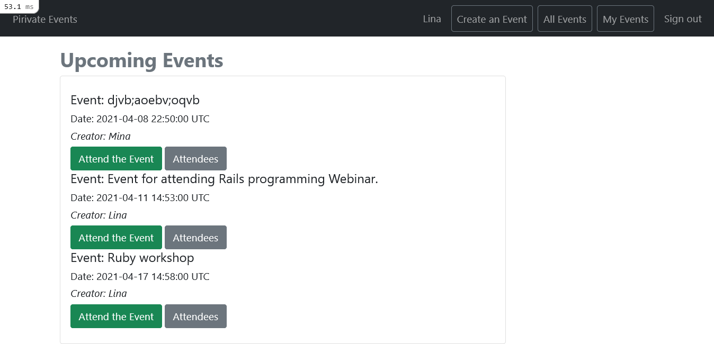

# Private Events


The private-event project allows the user to create and attend events that take place at a specific date and time.



## Build with
* Ruby 3.0
* Rais 6
* SQL lite

## Getting started

**To clone and run the application locally, use the following steps:**
- On Github, on the main page of the private-event repository, click  and copy "Clone with HTTPS" by clicking .
- In your terminal, enter a 'git clone` and past the link that you copied from the repository, and press the 'Enter'(e.g. git clone https://github.com/gdumani/private-events.git).
- Navigate to the project folder using `cd folder_name`
- To install all dependencies, run `bundle install`
- To create a database, run `db:create`
- To migrate the schema, run `db:migrate`
- Now, you can run your application using the `rails s` command.
- To verify the connection [Visit localhost:3000](http://localhost:3000 ).
- To configure SQLight3 for Heroku Deployment replace `gem 'sqlite3'` in the `Gemfile` with the following code:

```
group :development, :test do
 gem 'sqlite3'
end

group :production do
  gem 'pg'
end
```

## Instruction for creating an association between the User and Event
**One-To-Many Relationship**
```
To create a one-to-many association, we create User and Event databases.
As Users can have multiple events, we need a one-to-many association to
represent it. 
We specify the User and Event relationship by adding has_many:events 
to the User model and belongs_to:User to the Event model.
Then, we add user_id foreign_key in the Event table using migration.
```
**Many-To-Many Relationship**
```
Since in this project, the User can attend multiple events and the Event can
have many users we need a many-to-many association to relate the User to the
attending event through a joining table called Attended_event that allows
us to query the relationship between the two tables.
```
We design a database schema using the following diagram:


## Instruction for RSpec installation
- add `gem rspec-rails` and `gem 'rexml'` to the Gem file
- run `bundle install`
- run `rails generate rspec:install` to create spec directory and spec_helper.rb files
- run `rails generate rspec:model model_name` to create tests for model associations and validations.
- You can use the `rspec` or `bundle exec rspec` command to run all spec files.
- To test files in a single directory, run `rspec spec/models`
- To test a single spec file, run `rspec spec/models/user_spec.rb`
- To run a specific example from your user_spec.rb file, run `rspec spec/models/user_spec.rb:5`

## Authors

**Giancarlo Dumani**

- GitHub: [@gdumani](https://github.com/gdumani)
- Twitter: [@gdumani1](https://twitter.com/gdumani1)
- LinkedIn: [ Giancarlo-Dumani](https://www.linkedin.com/in/gdumani/?originalSubdomain=cr)

**Mina**

- GitHub: [@Takhmina175](https://github.com/Takhmina175)
- Twitter: [@Takhmin73630110](https://twitter.com/Takhmin73630110)
- LinkedIn: [Takhmina Makhkamova](https://www.linkedin.com/in/takhmina-makhkamova-7628136b/)

## Show your support

Give a ⭐️ if you like this project!

## License

This project is [MIT](./LICENSE) licensed.

## Acknowledgements

- [Microverse](https://microverse.org)
