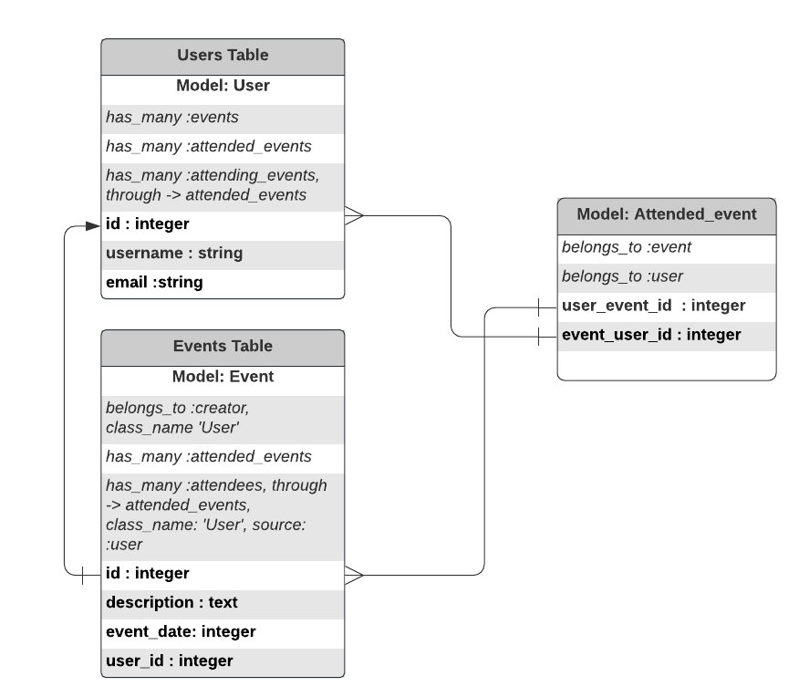

# Private Events


### Purpose:
The private-event project allows the user to create events and then manage user signups. Events take place at a specific date and time described by the user.

## Build with
* Ruby 2.7.0
* Rais 6
* SQL lite

## Getting started

To clone and run the application locally, use the following steps:
- Clone the repository from GitHub, using the `git clone` command.
- Create the new application and switch to its folder `$cd folder name`.
- Run `bundle` in the terminal to install the gems.
- Run `rails server` to connect to the server.
- To verify the connection [Visit localhost:3000](http://localhost:3000 ).
- To set up and configure your database for the first time, use `rails db:create` command.
- To configure SQLight3 for Heroku Deployment replace `gem 'sqlite3'` in the `Gemfile` with the following code:

```
group :development, :test do
 gem 'sqlite3'
end

group :production do
  gem 'pg'
end
```

## Instruction for creating an associations between the User and Event
**One-To-Many Relationship**
```
To create a one-to-many association, we create User and Event databases. 
As Users can have multiple events, we need a one-to-many association to represent it.   We specify the User and Event relationship by adding `has_many: events` to the User model and `belongs_to: User` to the Event model.  Then, we add `user_id foreign_key` in the Event table using migration.
```
**Many-To-Many Relationship**
```
Since in this project, the User can attend multiple events and the Event can have   many users we need a many-to-many association to relate the User to the attending   event through a joining table called `Attended_event` that allows us to query the   relationship between the two tables.
```
We design a database schema using the following diagram >



## Instruction for RSpec installation
- add `gem rspec-rails' and `gem 'rexml' to the `Gem file`
- run `bundle install`
- run `rails generate rspec:install` to create spec directory and spec_helper.rb files
- run `rails generate rspec:model model_name` to create tests for model associations and validations.

## Authors

**Giancarlo Dumani**

- GitHub: [@gdumani](https://github.com/gdumani)
- Twitter: [@gdumani1](https://twitter.com/gdumani1)
- LinkedIn: [ Giancarlo-Dumani](https://www.linkedin.com/in/gdumani/?originalSubdomain=cr)

**Mina**

- GitHub: [@Takhmina175](https://github.com/Takhmina175)
- Twitter: [@Takhmin73630110](https://twitter.com/Takhmin73630110)
- LinkedIn: [Takhmina Makhkamova](https://www.linkedin.com/in/takhmina-makhkamova-7628136b/)

## Show your support

Give a ⭐️ if you like this project!

## License

This project is [MIT](./LICENSE) licensed.

## Acknowledgements

- [Microverse](https://microverse.org)
